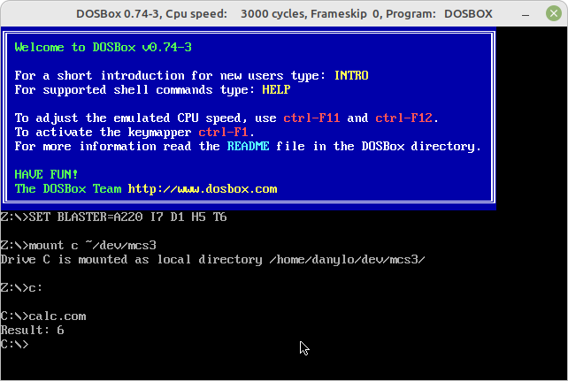

За приклад взятий класичний граф соц мережі - Krackhardt Kite Social Network
Цей граф є частиною бібліотеки networkx

## Візуалізація

## Аналіз

### Граф зв'язаний, кількість вершин - 10, кількість ребер - 18  

### Центральність:
{0: 0.4444444444444444, 1: 0.4444444444444444, 2: 0.3333333333333333, 3: 0.6666666666666666, 4: 0.3333333333333333, 5: 0.5555555555555556, 6: 0.5555555555555556, 7: 0.3333333333333333, 8: 0.2222222222222222, 9: 0.1111111111111111}
### Близькість
{0: 0.5294117647058824, 1: 0.5294117647058824, 2: 0.5, 3: 0.6, 4: 0.5, 5: 0.6428571428571429, 6: 0.6428571428571429, 7: 0.6, 8: 0.42857142857142855, 9: 0.3103448275862069}
### Посередництво
{0: 0.023148148148148143, 1: 0.023148148148148143, 2: 0.0, 3: 0.10185185185185183, 4: 0.0, 5: 0.23148148148148148, 6: 0.23148148148148148, 7: 0.38888888888888884, 8: 0.2222222222222222, 9: 0.0}

## BFS для вершини - 1
1 0 3 4 6 2 5 7 8 9 
## DFS для вершини - 1
1 0 2 3 4 6 5 7 8 9 

Як бачимо, BFS обходить спочатку ближні вершини, як і задумано, в той час як DFS будує лянцюжок в гбилину

## Алгоритм Дайкстри

Оскільки вага не має жодного значення в соц мережі, будемо вважати, що всі ребра мають ооднокаву вагу - 1,
це дозволить інтерпритувати найкоротшу відстань як "кількість рукостискань" від особи до особи

Результат - кількість рукостискань :\
0 - {0: 0, 1: 1, 2: 1, 3: 1, 4: 2, 5: 1, 6: 2, 7: 2, 8: 3, 9: 4}\
1 - {0: 1, 1: 0, 2: 2, 3: 1, 4: 1, 5: 2, 6: 1, 7: 2, 8: 3, 9: 4}\
2 - {0: 1, 1: 2, 2: 0, 3: 1, 4: 2, 5: 1, 6: 2, 7: 2, 8: 3, 9: 4}\
3 - {0: 1, 1: 1, 2: 1, 3: 0, 4: 1, 5: 1, 6: 1, 7: 2, 8: 3, 9: 4}\
4 - {0: 2, 1: 1, 2: 2, 3: 1, 4: 0, 5: 2, 6: 1, 7: 2, 8: 3, 9: 4}\
5 - {0: 1, 1: 2, 2: 1, 3: 1, 4: 2, 5: 0, 6: 1, 7: 1, 8: 2, 9: 3}\
6 - {0: 2, 1: 1, 2: 2, 3: 1, 4: 1, 5: 1, 6: 0, 7: 1, 8: 2, 9: 3}\
7 - {0: 2, 1: 2, 2: 2, 3: 2, 4: 2, 5: 1, 6: 1, 7: 0, 8: 1, 9: 2}\
8 - {0: 3, 1: 3, 2: 3, 3: 3, 4: 3, 5: 2, 6: 2, 7: 1, 8: 0, 9: 1}\
9 - {0: 4, 1: 4, 2: 4, 3: 4, 4: 4, 5: 3, 6: 3, 7: 2, 8: 1, 9: 0}